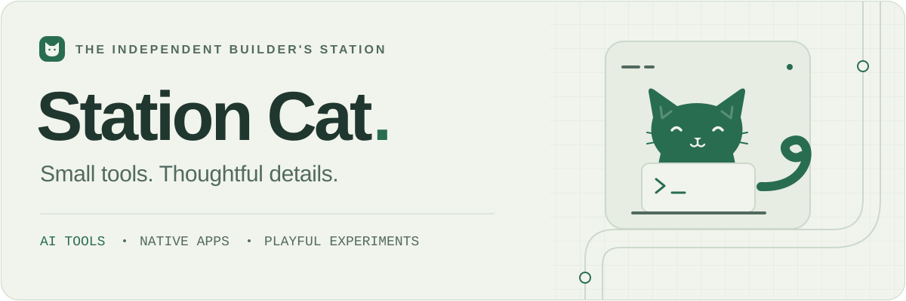

<picture>
  <source media="(prefers-color-scheme: dark)" srcset="./assets/station-cat-dark.svg" />
  <source media="(prefers-color-scheme: light)" srcset="./assets/station-cat-light.svg" />
  
</picture>

  <a href="https://wwwstationcat.org/"><strong>Website ↗</strong></a>
  &nbsp; · &nbsp;
  <a href="#selected-work">Projects</a>
  &nbsp; · &nbsp;
  <a href="https://github.com/xdgf558?tab=repositories">Repositories</a>

### Hi, I'm Station Cat.

I build AI tools, native apps, and playful web experiences, with a focus on local-first design and thoughtful details.

独立开发者，把日常里的想法做成实用的 AI 工具、原生应用和有趣的 Web 体验。偏爱本地优先、清晰的工作流，以及用起来顺手的小细节。

## Selected work

<table>
  <tr>
    <td width="50%" valign="top">
      
      <h3><a href="https://github.com/xdgf558/novelforge-ai">NovelForge AI ↗</a></h3>
      
Local-first AI writing, with structured story memory and the author in control.

      
本地优先的 AI 小说创作工作台，让故事记忆井然有序。

      
<code>TypeScript</code> <code>Electron</code> <code>SQLite</code>

    </td>
    <td width="50%" valign="top">
      
      <h3><a href="https://github.com/xdgf558/MindBudget">MindBudget · 花有数 ↗</a></h3>
      
A gentle iPhone budgeting companion for spending and habits, with data kept on device.

      
温和的预算与消费复盘工具，让每一笔花费心里有数。

      
<code>SwiftUI</code> <code>SwiftData</code> <code>iOS</code>

    </td>
  </tr>
  <tr>
    <td width="50%" valign="top">
      
      <h3><a href="https://github.com/xdgf558/codex-mobile-controller">Codex Mobile Controller ↗</a></h3>
      
A phone companion for local Codex tasks, connected through a paired desktop bridge.

      
通过已配对的桌面 Bridge，在手机上查看和管理本机任务。

      
<code>TypeScript</code> <code>Node.js</code> <code>Mobile</code>

    </td>
    <td width="50%" valign="top">
      
      <h3><a href="https://github.com/xdgf558/private-pinyin-ime">PrivatePinyin · 猫栈拼音 ↗</a></h3>
      
Privacy-first Chinese input, powered by a local Rust engine.

      
在本机解析拼音、学习词库，探索更安心的中文输入体验。

      
<code>Rust</code> <code>macOS</code> <code>Windows</code> <code>iOS</code>

    </td>
  </tr>
</table>

  
<strong>More from the station · 更多作品</strong>

   
  
<a href="https://github.com/xdgf558/caption-ai-landing-site"><strong>Station Cat Website</strong></a> — 品牌网站，收录应用、连载小说与开发记录。 <code>Astro</code>

  
<a href="https://github.com/xdgf558/cat-life-game"><strong>Cat Life Game</strong></a> — 一款关于工作、生活和养猫的浏览器小游戏。 <code>JavaScript</code>

  
<a href="https://github.com/xdgf558/ai-playable-novel-mvp"><strong>AI Playable Novel</strong></a> — 将 AI 叙事做成可以参与的故事体验。 <code>Python</code> <code>SwiftUI</code>

  
<a href="https://github.com/xdgf558/x-follow-cleaner"><strong>X Follow Cleaner</strong></a> — 在本地辅助检查 X 关注列表的 Chrome 扩展。 <code>JavaScript</code>

## At the workbench

Exploring AI-assisted creation, local-first apps, and calmer development workflows. My early-stage <a href="https://github.com/xdgf558/project-pilot">ProjectPilot</a> project is laying the groundwork for a native macOS tool to coordinate coding agents and GitHub tasks.

`TypeScript` `Swift / SwiftUI` `Rust` `Python` `Astro` `Node.js` `Cloudflare`

---

  <strong>Build small. Keep it useful. Make it feel right.</strong> 
  小步构建，认真打磨。欢迎来小站逛逛。

